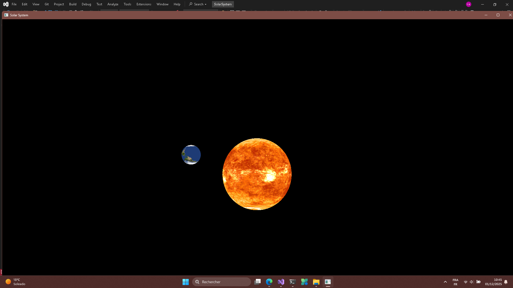

this project uses vcpkg as the package manager,glfw for the GUI window and Glad to interact with GPU drivers.
you can manually install the dependencies by following the instructions on their respective websites, or you can simply
run/double-click the "setup.bat" file to install the dependencies.

here is a simple proof
